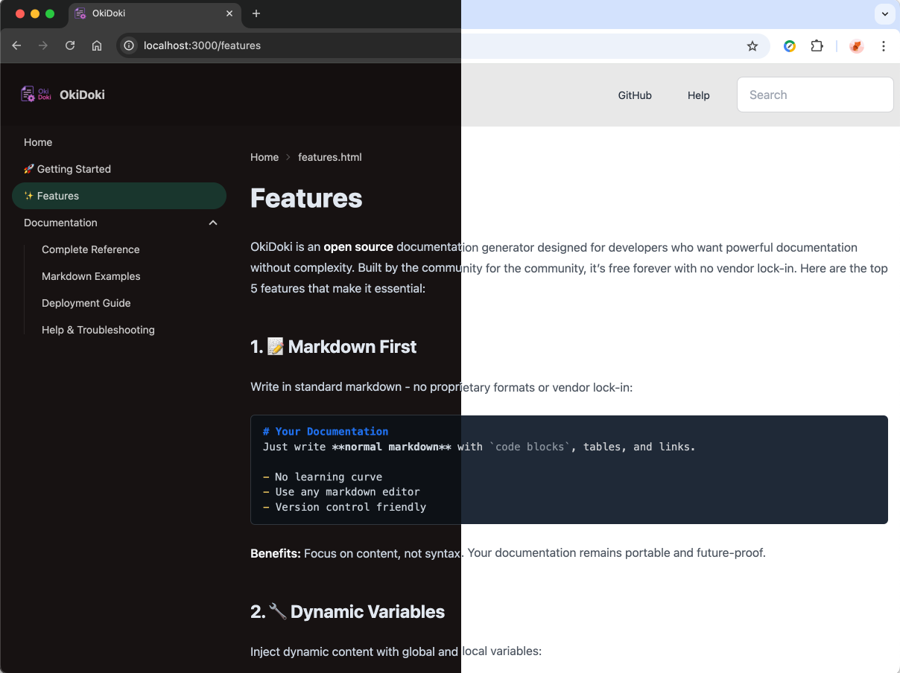

# Features

OkiDoki is an **open source** documentation generator designed for developers who want powerful documentation without complexity. Built by the community for the community, it's free forever with no vendor lock-in. Here are the top 5 features that make it essential:

## 1. 📝 Markdown First

Write in standard markdown - no proprietary formats or vendor lock-in:

```markdown
# Your Documentation
Just write **normal markdown** with `code blocks`, tables, and links.

- No learning curve
- Use any markdown editor
- Version control friendly
```

**Benefits:** Focus on content, not syntax. Your documentation remains portable and future-proof.

## 2. 🔧 Dynamic Variables

Inject dynamic content with global and local variables:

### Global Variables (`okidoki.yaml`)
```yaml
globals:
  version: "2.1.0"
  api_url: "https://api.example.com"
  company: "Acme Corp"
```

### Local Variables (Frontmatter)
```markdown
---
title: "API Guide"
author: "John Doe"
updated: "2024-01-15"
---

# {{title}} v{{globals.version}}
Built by {{author}} for {{globals.company}}
Updated: {{updated}}
```

**Benefits:** Keep documentation up-to-date automatically. Change once, update everywhere.

## 3. 🎨 Tabs, Badges and Admonitions

Rich interactive components without HTML:

### Tabs

<div>
<pre>
&#58;&#58;&#58;tabs
&#58;&#58;&#58;tab JavaScript
```js
const api = new ApiClient('{{api_url}}');
console.log('Ready ...')
```
&#58;&#58;&#58;
&#58;&#58;&#58;tab Python
```python
api = ApiClient('{{api_url}}')
print('Ready ...')
```
&#58;&#58;&#58;
&#58;&#58;&#58;
</pre>
</div>

:::tabs
:::tab JavaScript
```js
const api = new ApiClient('{{api_url}}');
console.log('Ready ...')
```
:::
:::tab Python
```python
api = ApiClient('{{api_url}}')
print('Ready ...')
```
:::
:::

### Badges and Admonitions :::badge-primary cool ::: :::badge-success feature :::

#### Badges
```markdown
User API :::badge-primary GET ::: :::badge-success Stable :::
```

#### Admonitions
```markdown
:::tip
Pro tip: Use admonitions to highlight important information!
:::
```
:::tip
**Advice:** Don't overuse it!
:::

**Benefits:** Professional documentation with zero configuration. Draw attention to important information with styled callouts.


## 4. 🌗 Auto Light/Dark Themes

Beautiful themes powered by Tailwind CSS and DaisyUI:

```yaml
site:
  theme:
    light: "fantasy"    # Corporate, emerald, garden, lofi, pastel, cmyk
    dark: "forest"      # Aqua, luxury, dracula, synthwave, halloween, coffee
```
Screenshot of the light theme `fantasy` and dark theme `forest`:



**Benefits:** 
- Automatic OS theme detection
- Toggle between themes
- 14+ professional themes included
- Fully responsive design

## 5. ⚡ Full-Text Search

Instant search across all documentation:

- **Client-side**: No server required
- **Instant results**: Search as you type
- **Smart ranking**: Most relevant results first
- **Keyboard shortcuts**: Quick navigation

```yaml
search:
  enabled: true
  placeholder: "Search documentation..."
```

**Benefits:** Users find answers fast. Works offline and scales to thousands of pages.

---

## Why OkiDoki?

- **Fast**: Generate docs in under 1 second
- **Small**: ~50KB generated sites
- **Simple**: Two config files, standard markdown
- **Powerful**: Variables, themes, search, components
- **Flexible**: Deploy anywhere static files work
- **Open Source**: Community-driven, transparent, and free forever

### 🔓 Open Source Benefits

OkiDoki is **100% open source**, which means:

- **No vendor lock-in**: Your content stays yours in standard markdown
- **Community-driven**: Features requested and built by real users
- **Transparent**: See exactly how your docs are generated
- **Extensible**: Contribute features, themes, and improvements
- **Free forever**: No licensing fees, usage limits, or hidden costs
- **Trustworthy**: Audit the code, report issues, fix bugs together

:::tip
**Community matters**: Open source ensures OkiDoki evolves with developer needs, not corporate agendas. Join the community and help shape the future of documentation!
:::

Get started in 30 seconds: `npm install -g okidoki && okidoki init` 🚀 