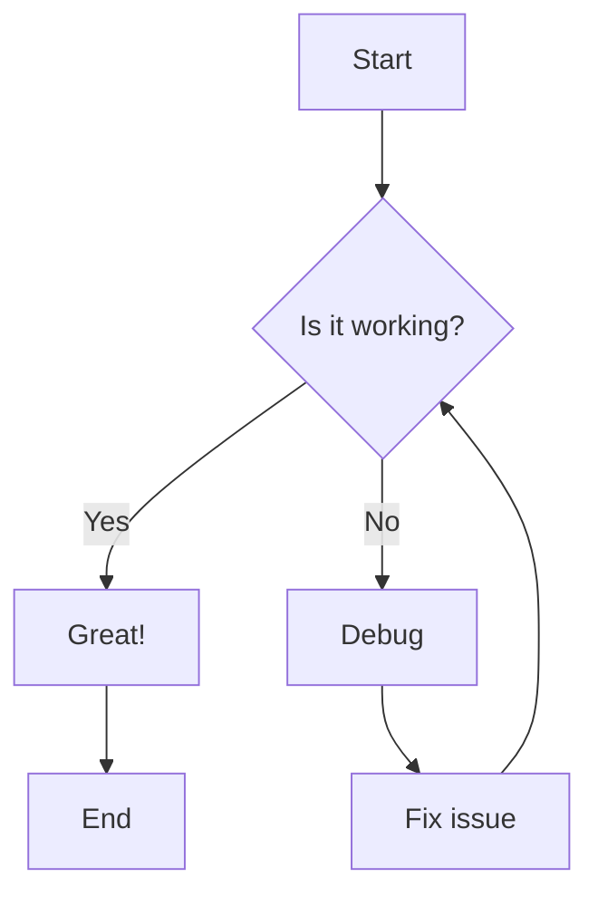
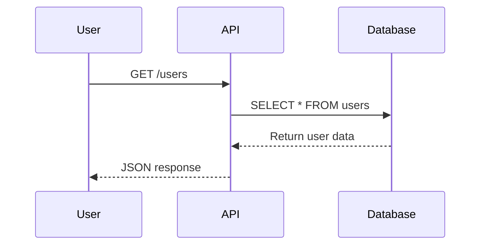
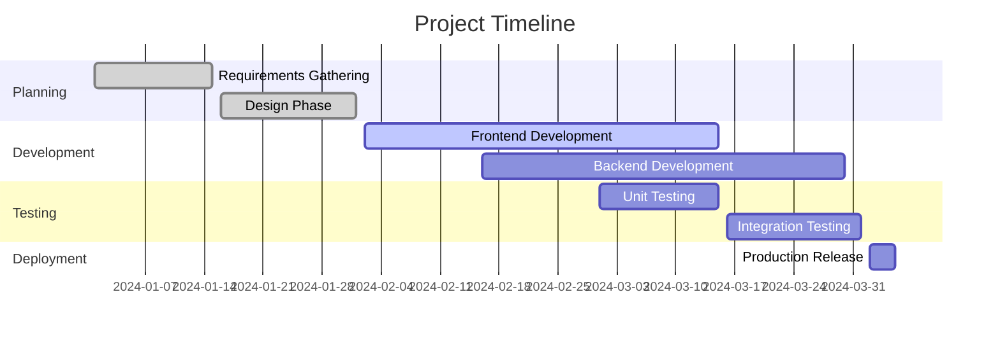

---
pagenav:
  levels: 1
keywords: [
  "okidoki markdown examples",
  "markdown syntax guide",
  "documentation examples",
  "handlebars helpers examples",
  "okidoki tabs syntax",
  "okidoki badges examples",
  "okidoki alerts examples",
  "markdown formatting guide",
  "documentation formatting",
  "okidoki syntax reference",
  "emoji examples",
  "mathematical expressions examples",
  "mermaid diagram examples",
  "table of contents examples",
  "emoji support",
  "mathematical expressions",
  "mermaid diagrams",
  "automatic table of contents"
]
local_version: "1.0.1"
api_url: "https://api.example.com"
support_email: "support@example.com"
author: "**John Doe**"
author_url: "https://example.com"
author_image: "https://example.com/avatar.png"
author_bio: "John Doe is a good man"
author_twitter: "https://twitter.com/johndoe"
author_linkedin: "https://linkedin.com/in/johndoe"
---

# Markdown Examples

This page demonstrates various markdown formatting and documentation patterns you can use in your OkiDoki documentation.

## Headers

```markdown
# H1 - Main Title
## H2 - Section Title  
### H3 - Subsection
#### H4 - Sub-subsection
##### H5 - Minor Heading
###### H6 - Smallest Heading
```

**Result:** 👇

# H1 - Main Title
## H2 - Section Title  
### H3 - Subsection
#### H4 - Sub-subsection
##### H5 - Minor Heading
###### H6 - Smallest Heading

## Text Formatting

```markdown
**Bold text** or __bold text__
*Italic text* or _italic text_
***Bold and italic*** or ___bold and italic___
~~Strikethrough text~~
`Inline code`
```

**Result:** 👇

**Bold text**, *italic text*, ***bold and italic***, ~~strikethrough text~~, `inline code`

## Lists

### Unordered Lists
```markdown
- First item
- Second item
  - Nested item
  - Another nested item
- Third item
```

**Result:** 👇

- First item
- Second item
  - Nested item
  - Another nested item
- Third item

### Ordered Lists
```markdown
1. First step
2. Second step
   1. Nested step
   2. Another nested step
3. Third step
```

**Result:** 👇
1. First step
2. Second step
   1. Nested step
   2. Another nested step
3. Third step

## Links and Images

```markdown
[Link text](https://example.com)

[Internal link](reference.md)

[Link with title](https://example.com "Example Website")

68px image: 

Full size image: 

Clickable image: [](https://example.com)
```

**Result:** 👇

[Link text](https://example.com)

[Internal link](reference.md)

[Link with title](https://example.com "Example Website")

68px image: 

Full size image: 

Clickable image: [](https://example.com)

## Code Blocks

### JavaScript Example
````markdown
```javascript
function calculateTotal(items) {
  return items.reduce((sum, item) => {
    return sum + (item.price * item.quantity);
  }, 0);
}

// Usage
const cartItems = [
  { name: "Book", price: 12.99, quantity: 2 },
  { name: "Pen", price: 1.50, quantity: 5 }
];

console.log(`Total: $${calculateTotal(cartItems)}`);
```
````

**Result:** 👇

```javascript
function calculateTotal(items) {
  return items.reduce((sum, item) => {
    return sum + (item.price * item.quantity);
  }, 0);
}

// Usage
const cartItems = [
  { name: "Book", price: 12.99, quantity: 2 },
  { name: "Pen", price: 1.50, quantity: 5 }
];

console.log(`Total: $${calculateTotal(cartItems)}`);
```

### Python Example  
````markdown
```python
def fibonacci(n):
    """Generate Fibonacci sequence up to n terms."""
    if n <= 0:
        return []
    elif n == 1:
        return [0]
    elif n == 2:
        return [0, 1]
    
    fib_seq = [0, 1]
    for i in range(2, n):
        fib_seq.append(fib_seq[i-1] + fib_seq[i-2])
    
    return fib_seq

# Generate first 10 Fibonacci numbers
print(fibonacci(10))
```
````

**Result:** 👇

```python
def fibonacci(n):
    """Generate Fibonacci sequence up to n terms."""
    if n <= 0:
        return []
    elif n == 1:
        return [0]
    elif n == 2:
        return [0, 1]
    
    fib_seq = [0, 1]
    for i in range(2, n):
        fib_seq.append(fib_seq[i-1] + fib_seq[i-2])
    
    return fib_seq

# Generate first 10 Fibonacci numbers
print(fibonacci(10))
```

### YAML Configuration
````markdown
```yaml
site:
  title: "My API Documentation"
  description: "Complete API reference and guides"
  theme:
    light: "fantasy"
    dark: "forest"
  
globals:
  version: "2.1.0"
  api_base: "https://api.example.com/v1"
  
search:
  enabled: true
  placeholder: "Search API docs..."
```
````
**Result:** 👇
```yaml
site:
  title: "My API Documentation"
  description: "Complete API reference and guides"
  theme:
    light: "fantasy"
    dark: "forest"
  
globals:
  version: "2.1.0"
  api_base: "https://api.example.com/v1"
  
search:
  enabled: true
  placeholder: "Search API docs..."
```

### Shell Commands
````markdown
```bash
# Install dependencies
npm install

# Start development server
npm run dev

# Build for production  
npm run build

# Run tests
npm test
```
````
**Result:** 👇

```bash
# Install dependencies
npm install

# Start development server
npm run dev

# Build for production  
npm run build

# Run tests
npm test
```

## Tables

```markdown
| Method   | Endpoint          | Parameters         | Response         | Notes            |
|:---------|:------------------|:-------------------|:-----------------|:-----------------|
| `GET`    | `/api/users`      | `?limit=10&page=1` | User array       | Fast             |
| `POST`   | `/api/users`      | User object        | Created user     | Auth required    |
| `PUT`    | `/api/users/{id}` | User ID + data     | Updated user     | Idempotent       |
| `DELETE` | `/api/users/{id}` | User ID only       | `204 No Content` | Permanent        |
```

**Result:** 👇
| Method   | Endpoint          | Parameters         | Response         | Notes            |
|:---------|:------------------|:-------------------|:-----------------|:-----------------|
| `GET`    | `/api/users`      | `?limit=10&page=1` | User array       | Fast             |
| `POST`   | `/api/users`      | User object        | Created user     | Auth required    |
| `PUT`    | `/api/users/{id}` | User ID + data     | Updated user     | Idempotent       |
| `DELETE` | `/api/users/{id}` | User ID only       | `204 No Content` | Permanent        |

## Blockquotes

```markdown
> This is a blockquote. It can be used for highlighting important information,
> quotes, or notes.

> **Tip:** You can also use blockquotes for tips and warnings.
```

**Result:** 👇
> This is a blockquote. It can be used for highlighting important information,
> quotes, or notes.

> **Tip:** You can also use blockquotes for tips and warnings.

## Horizontal Rules

```markdown
---

***

___
```
**Result:** 👇

---

## Global Variables

Use variables defined in your `okidoki.yaml` configuration file, or in the markdown heading, to inject dynamic content into your markdown documentation. This powerful feature allows you to:

- Maintain consistent values across all documentation
- Update information in one place
- Keep sensitive data like API keys in configuration
- Create reusable content blocks
- Support multiple environments (dev/staging/prod)

For example, you can define variables for:

```yaml
# Okidoki Configuration
site:
  title: "My Docs"
  description: "Docs generated with Okidoki"
  theme:
    light: "fantasy"
    dark: "forest"

local_version: "1.0.1"
api_url: "https://api.example.com"
support_email: "support@example.com"
author: "**John Doe**"
author_url: "https://example.com"
author_image: "https://example.com/avatar.png"
author_bio: "John Doe is a good man"
author_twitter: "https://twitter.com/johndoe"
author_linkedin: "https://linkedin.com/in/johndoe"
```
Reference them in your markdown file:

```markdown
Current version: \{{local_version}}

API endpoint: \{{api_url}}

Support email: \{{support_email}}
```

**Result:** 👇

Current version: {{local_version}}

API endpoint: {{api_url}}

Support email: {{support_email}}

{{alert "Use triple curly brackets to encode stuff `{{{encoded_content_variable_here}}}`."}}


## Important Messages & Callouts

Create important message callouts using Handlebars alert helpers to enhance your documentation with visually distinct notifications, warnings, and informational blocks. These alerts help draw attention to critical information, warnings, success messages, and other important content.

The alert system supports both simple one-line messages and complex blocks with full markdown formatting. You can use them to:

- Highlight important warnings or notices
- Display success/error messages
- Show informational callouts
- Create attention-grabbing notes
- Add status indicators

Choose from multiple alert styles to convey different types of messages with appropriate visual emphasis.

### Simple Alert Syntax

For basic alerts with text only:

````markdown
\{{alert "This is an informational callout." "info"}}
\{{alert "This is a success message." "success"}}
\{{alert "This is a warning message." "warning"}}
\{{alert "This is an error alert." "error"}}
\{{alert "This is neutral information."}}
````

**Result:** 👇
{{alert "This is an informational callout." "info"}}
{{alert "This is a success message." "success"}}
{{alert "This is a warning message." "warning"}}
{{alert "This is an error alert." "error"}}
{{alert "This is neutral information."}}

### Block Alert Syntax

For alerts with complex content including markdown:

````markdown
\{{#alert type="info"}}
Information alert with **markdown** support and [links](https://example.com)
\{{/alert}}

\{{#alert type="warning"}}
Warning alert with `code` and multiple lines of content
\{{/alert}}
````

**Result:** 👇
{{#alert type="info"}}
Information alert with **markdown** support and [links](https://example.com)
{{/alert}}

{{#alert type="warning"}}
Warning alert with `code` and multiple lines of content
{{/alert}}

### Available Alert Types

- **info** - Blue, for general information
- **success** - Green, for positive messages
- **warning** - Orange/yellow, for important warnings
- **error** - Red, for critical alerts
- **blank** - Gray, for neutral information (default)

### Complex Example with Code

````markdown
\{{#alert type="error"}}
❌ **Error**: Critical code detected!
```javascript
console.log('Be careful with this');
process.exit(1);
```

Please check your [code file](index.js) and ensure that your code is sanitized.
\{{/alert}}
````

**Result:** 👇
{{#alert "error"}}
❌ **Error**: Critical code detected!
```js
let msg = "error";
console.log('Be careful with this', msg);
process.exit(1);
```

Please check your [code file](index.js) and ensure that your code is sanitized.
{{/alert}}

## Badges

Here are some examples of the badge functionality. Badges are a powerful way to highlight important information, status indicators, or metadata in your documentation. They can be used standalone, inline with text, or to enhance headings and sections.

You can customize badges with different colors and styles to create visual hierarchies and improve the scannability of your documentation. The following examples demonstrate various ways to use badges effectively:

### Basic Badges
````markdown
\{{badge "Default Badge"}}
````

**Result:** 👇

{{badge "Default Badge"}}

### Colored Badges  
````markdown
\{{badge "Primary" "primary"}}
\{{badge "Secondary" "secondary"}}
\{{badge "Accent" "accent"}}
\{{badge "Info" "info"}}
\{{badge "Success" "success"}}
\{{badge "Warning" "warning"}}
\{{badge "Error" "error"}}
````

**Result:** 👇

{{badge "Primary" "primary"}}
{{badge "Secondary" "secondary"}}
{{badge "Accent" "accent"}}
{{badge "Info" "info"}}
{{badge "Success" "success"}}
{{badge "Warning" "warning"}}
{{badge "Error" "error"}}


### Badges in Text
````markdown
You can use badges inline like this \{{badge "Status: Active" "success"}} within your text content.
````

**Result:** 👇

You can use badges inline like this {{badge "Status: Active" "success"}} within your text content.

### Practical Examples

#### API Documentation
```markdown
## Get User \{{badge "GET" "primary"}}
## Create User \{{badge "POST" "success"}}
## Update User \{{badge "PUT" "warning"}}
## Delete User \{{badge "DELETE" "error"}}
```

**Result:** 👇
## Get User {{badge "GET" "primary"}}
## Create User {{badge "POST" "success"}}
## Update User {{badge "PUT" "warning"}}
## Delete User {{badge "DELETE" "error"}}

#### Version and Status Indicators
```markdown
# My Project \{{badge "v2.1.0" "info"}} \{{badge "Stable" "success"}}

Features:
- Authentication \{{badge "✅ Complete" "success"}}
- Dashboard \{{badge "🚧 In Progress" "warning"}}
- Analytics \{{badge "📋 Planned" "outline"}}
- Mobile App \{{badge "❌ Deprecated" "error"}}
```

**Result:** 👇
# My Project {{badge "v2.1.0" "info"}} {{badge "Stable" "success"}}

Features:
- Authentication {{badge "✅ Complete" "success"}}
- Dashboard {{badge "🚧 In Progress" "warning"}}
- Analytics {{badge "📋 Planned" "outline"}}
- Mobile App {{badge "❌ Deprecated" "error"}}

## HTML in Markdown

You can also use HTML for more complex formatting:

```html
<div class="bg-base-300" style="padding: 2em; margin-bottom: 2em">
  <h4>Custom HTML Block</h4>
  <p>Sometimes you need more control over the formatting.</p>
  <ul>
    <li><strong>Bold item</strong></li>
    <li><em>Italic item</em></li>
  </ul>
</div>
```
**Result:** 👇
<div class="bg-base-300" style="padding: 2em; margin-bottom: 2em">
  <h4>Custom HTML Block</h4>
  <p>Sometimes you need more control over the formatting.</p>
  <ul>
    <li><strong>Bold item</strong></li>
    <li><em>Italic item</em></li>
  </ul>
</div>


## Tabs Demo

This page demonstrates the powerful Handlebars tabs syntax, which allows you to create interactive tabbed content perfect for:

- Showing code examples in multiple programming languages
- Displaying platform-specific instructions (Windows/Mac/Linux)
- Organizing related content in a space-efficient way
- Creating interactive API documentation with different response types
- Presenting multiple configuration formats

The tabs are fully responsive, keyboard accessible, and maintain their selected state during page navigation.

### Tabs Syntax

Create interactive tabbed content using Handlebars helpers:

````markdown
\{{#tabs}}
\{{#tab title="JavaScript"}}
```javascript
const message = "Hello from JavaScript!";
console.log(message);
// more code here
```
\{{/tab}}
\{{#tab title="Python"}}
```python
def main():
# more code here
```
\{{/tab}}
\{{/tabs}}
````

**Result:** 👇

{{#tabs}}
{{#tab title="JavaScript"}}
```javascript
const message = "Hello from JavaScript!";
console.log(message);

// Fetch data from API
fetch('/api/users')
  .then(response => response.json())
  .then(data => console.log(data));
```
{{/tab}}
{{#tab title="Python"}}
```python
def main():
    message = "Hello from Python!"
    print(message)

    # Fetch data from API
    import requests
    try:
        response = requests.get('/api/users')
        data = response.json()
        print(data)
    except Exception as e:
        print(f"Error: {e}")

if __name__ == "__main__":
    main()
```
{{/tab}}
{{#tab title="cURL"}}
```bash
# Get users from API
curl -X GET \
  'https://api.example.com/users' \
  -H 'Accept: application/json' \
  -H 'Authorization: Bearer your-token'
```
{{/tab}}
{{/tabs}}


### Another Example with Mixed Content

````markdown
\{{#tabs}}
\{{#tab title="Overview"}}
Here's some regular markdown content in a tab.

- Feature A: Does something cool
- Feature B: Does something else
- Feature C: Does something amazing

> **Note**: This tab contains mixed content - not just code!
\{{/tab}}
\{{#tab title="TypeScript"}}
```typescript
interface User {
  id: number;
  name: string;
  email: string;
}

class UserService {
  async getUser(id: number): Promise<User> {
    const response = await fetch(`/api/users/${id}`);
    return response.json();
  }
}
```
\{{/tab}}
\{{#tab title="Configuration"}}
```yaml
# config.yml
api:
  baseUrl: "https://api.example.com"
  timeout: 30000
  retries: 3

features:
  enableCache: true
  enableLogging: true
  enableMetrics: false
```
\{{/tab}}
\{{/tabs}}
````

**Result:** 👇

{{#tabs}}
{{#tab title="Overview"}}
Here's some regular markdown content in a tab.

- Feature A: Does something cool
- Feature B: Does something else
- Feature C: Does something amazing

> **Note**: This tab contains mixed content - not just code!
{{/tab}}
{{#tab title="TypeScript"}}
```typescript
interface User {
  id: number;
  name: string;
  email: string;
}

class UserService {
  async getUser(id: number): Promise<User> {
    const response = await fetch(`/api/users/${id}`);
    return response.json();
  }
}
```
{{/tab}}
{{#tab title="Configuration"}}
```yaml
# config.yml
api:
  baseUrl: "https://api.example.com"
  timeout: 30000
  retries: 3

features:
  enableCache: true
  enableLogging: true
  enableMetrics: false
```
{{/tab}}
{{/tabs}}

## YouTube Videos

Embed YouTube videos directly in your documentation using the built-in YouTube helper:

### Basic Video Embed

```markdown
\{{youtube "1XJ8bN7Cn9w"}}
```

**Result:** 👇
{{youtube "1XJ8bN7Cn9w" width="100%" height="420"}}

### Custom Dimensions

```markdown
\{{youtube "1XJ8bN7Cn9w" width="100%" height="420"}}
```


## Advanced Markdown Plugins

OkiDoki now supports several powerful markdown plugins that extend the standard markdown functionality with enhanced features for emojis, mathematical expressions, diagrams, and automatic table of contents generation.

### Emoji Support

Add emojis to your documentation. Simply use standard emoji shortcodes:

```markdown
:rocket: Launch your documentation
:heart: Made with love
:warning: Important notice
:white_check_mark: Task completed
:star: Featured content
```

**Result:** 👇

:rocket: Launch your documentation  
:heart: Made with love  
:warning: Important notice  
:white_check_mark: Task completed  
:star: Featured content

### Mathematical Expressions

Render beautiful mathematical expressions using MathJax3. Support both inline and block math expressions:

#### Inline Math

```markdown
The quadratic formula is $x = \frac{-b \pm \sqrt{b^2-4ac}}{2a}$ and it's very useful.
```

**Result:** 👇

The quadratic formula is $x = \frac{-b \pm \sqrt{b^2-4ac}}{2a}$ and it's very useful.

#### Block Math

```markdown
$$
\begin{align}
\nabla \times \vec{\mathbf{B}} -\, \frac1c\, \frac{\partial\vec{\mathbf{E}}}{\partial t} &= \frac{4\pi}{c}\vec{\mathbf{j}} \\
\nabla \cdot \vec{\mathbf{E}} &= 4 \pi \rho \\
\nabla \times \vec{\mathbf{E}}\, +\, \frac1c\, \frac{\partial\vec{\mathbf{B}}}{\partial t} &= \vec{\mathbf{0}} \\
\nabla \cdot \vec{\mathbf{B}} &= 0
\end{align}
$$
```

**Result:** 👇

$$
\begin{align}
\nabla \times \vec{\mathbf{B}} -\, \frac1c\, \frac{\partial\vec{\mathbf{E}}}{\partial t} &= \frac{4\pi}{c}\vec{\mathbf{j}} \\
\nabla \cdot \vec{\mathbf{E}} &= 4 \pi \rho \\
\nabla \times \vec{\mathbf{E}}\, +\, \frac1c\, \frac{\partial\vec{\mathbf{B}}}{\partial t} &= \vec{\mathbf{0}} \\
\nabla \cdot \vec{\mathbf{B}} &= 0
\end{align}
$$

### Mermaid Diagrams

Create beautiful diagrams and flowcharts. Perfect for visualizing processes, architectures, and relationships:

#### Flowchart Example

````markdown

````

**Result:** 👇


#### Sequence Diagram Example

````markdown

````

**Result:** 👇


#### Git Graph Example

````markdown

````

**Result:** 👇


### Automatic Table of Contents

Generate automatic table of contents. Simply add `[[TOC]]` anywhere in your document:

```markdown
My table of contents:
[[TOC]]

## This heading will show in the above TOC
```


## Best Practices

1. **Use descriptive headers** - Make it easy to scan and navigate
2. **Include code examples** - Show, don't just tell
3. **Add context** - Explain when and why to use something
4. **Keep it updated** - Outdated documentation is worse than no documentation
5. **Link related content** - Help users discover relevant information
6. **Use emojis sparingly** - Enhance readability without overwhelming content
7. **Keep math expressions simple** - Complex equations should be in separate blocks
8. **Test diagrams** - Ensure Mermaid diagrams render correctly
9. **Place TOC strategically** - Usually at the beginning of long documents


This comprehensive example should give you a solid foundation for creating rich, well-formatted documentation with OkiDoki! 