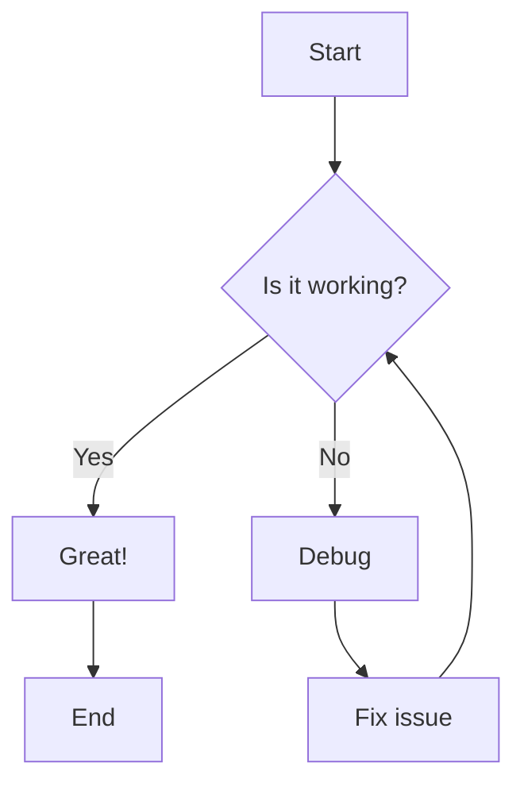
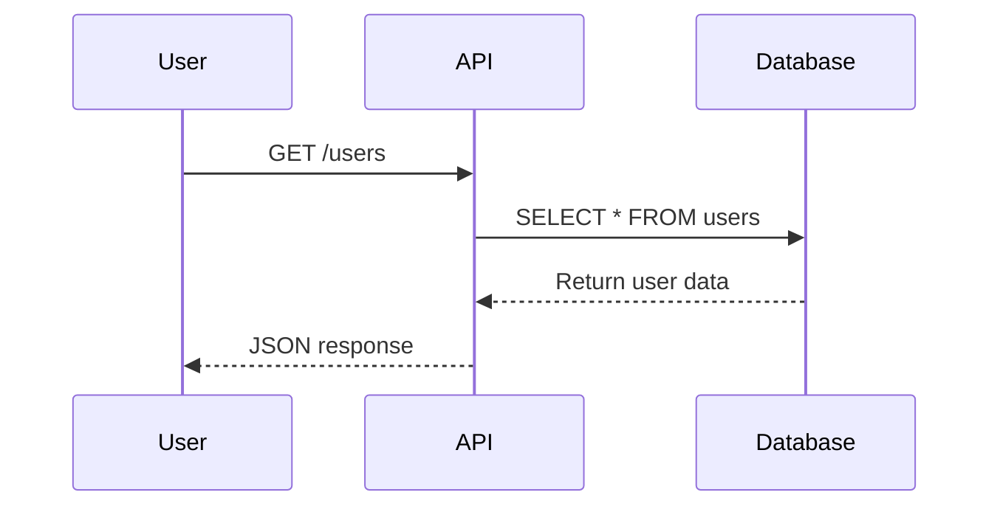

# Documentation Reference 

{{badge okidoki_version}}

Complete reference for OkiDoki documentation generator. 

Want to see how this official documentation site is built? Check out the [complete source code](https://github.com/jbeejones/okidoki-website).

## Commands

### `okidoki init`
Initialize a new documentation project.

**Usage:**
```bash
okidoki init [options]
```

**CLI Options:**

| Option | Short | Description | Default |
|--------|-------|-------------|---------|
| `--output` | `-o` | Output directory | (current directory) |
| `--config` | `-c` | Path to create okidoki configuration file | `"okidoki.yaml"` |
| `--sidebars` | `-b` | Path to create sidebars configuration file | `"sidebars.yaml"` |
| `--dev` | `-d` | Create a package.json with development scripts | `false` |
| `--help` | | Show help information | |
| `--version` | | Show version number | |

**Examples:**
```bash
# Initialize in current directory
okidoki init

# Initialize in specific directory
okidoki init --output ./my-documentation

# Custom config file names
okidoki init -c ./config.yaml -b ./navigation.yaml

# Include development setup
okidoki init --dev
```

**What it creates:**
- `okidoki.yaml` - Main configuration file
- `sidebars.yaml` - Navigation structure
- `docs/` directory with sample content
- `docs/index.md` - Homepage content
- `package.json` - Development scripts (when using `--dev`)

### `okidoki generate`
Generate the static documentation site.

**Usage:**
```bash
okidoki generate [options]
```

**CLI Options:**

| Option | Short | Description | Default |
|--------|-------|-------------|---------|
| `--source` | `-s` | Source directory containing markdown files | `"docs"` |
| `--output` | `-o` | Output directory for generated files | `"dist"` |
| `--config` | `-c` | Path to okidoki configuration file | `"okidoki.yaml"` |
| `--sidebars` | `-b` | Path to sidebars configuration file | `"sidebars.yaml"` |
| `--verbose` | `-v` | Enable verbose logging | `false` |
| `--help` | | Show help information | |
| `--version` | | Show version number | |

**Examples:**
```bash
# Basic usage (uses defaults)
okidoki generate

# Custom directories
okidoki generate --source ./documentation --output ./website

# Custom config files  
okidoki generate -c ./config/okidoki.yaml -b ./config/nav.yaml

# Enable verbose logging
okidoki generate -v

# Combine options
okidoki generate -s ./docs -o ./public -v
```

**Output:**
- Creates `dist/` directory with generated HTML files
- Copies assets and applies themes
- Generates search index for full-text search
- Creates `sitemap.xml` for SEO and search engine indexing
- Build time: < 1 second

**Development tip:** For automatic rebuilding during development, use:
```bash
npx nodemon -w ./docs -w okidoki.yaml -w sidebars.yaml -e md,png,jpg,jpeg,gif,svg,webp,yaml,yml --exec "okidoki generate && npx serve dist"
```

### `okidoki openapi`
Convert OpenAPI specification to markdown documentation.

**Usage:**
```bash
okidoki openapi [options]
```

**CLI Options:**

| Option | Short | Description | Default |
|--------|-------|-------------|---------|
| `--input` | `-i` | Path to OpenAPI specification file (JSON or YAML) | (required) |
| `--output` | `-o` | Output markdown file path | (auto-generated) |
| `--title` | `-t` | Title for the generated documentation | (auto-generated) |
| `--description` | `-d` | Description for the generated documentation | (auto-generated) |
| `--docs` | | Target docs directory | `"docs"` |
| `--sidebars` | `-b` | Path to sidebars configuration file | `"sidebars.yaml"` |
| `--config` | `-c` | Path to okidoki configuration file | `"okidoki.yaml"` |
| `--help` | | Show help information | |
| `--version` | | Show version number | |

**Examples:**
```bash
# Convert OpenAPI spec to markdown
okidoki openapi -i api-spec.yaml

# Specify custom output file
okidoki openapi -i api-spec.json -o custom-api-docs.md

# Set custom title and description
okidoki openapi -i spec.yaml -t "My API Documentation" -d "Complete API reference"

# Custom docs directory and config files
okidoki openapi -i spec.yaml --docs documentation -c config.yaml -b nav.yaml
```

**What it does:**
- Parses OpenAPI 3.x specification files (JSON or YAML format)
- Generates structured markdown documentation with:
  - API overview and metadata
  - Endpoint documentation with methods, parameters, and responses
  - Schema definitions and examples
  - Authentication requirements
- Automatically integrates with your existing documentation structure
- Updates sidebars configuration to include the generated documentation

## Configuration Files

### okidoki.yaml

Main configuration file for your documentation site.

#### Site Configuration
```yaml
site:
  title: "Site Title"             # Appears in browser title and header
  description: "Site Description" # Meta description for SEO
  url: "https://okidoki.dev"      # Full domain for absolute sitemap URLs
  logo: "/path/to/logo.png"       # Optional: Custom logo
  favicon: "/path/to/favicon.ico" # Optional: Custom favicon
  baseUrl: "/"                    # Optional: add path for subdirectory hosting
  friendlyUrl: true               # Optional: remove .html extensions from URLs
  language: "en"                  # Optional: default language for all pages
  theme:
    light: "light"                # DaisyUi theme
    dark: "dark"
```

**URL Configuration:**
- `url: "https://okidoki.dev"` - Full domain URL where your documentation is hosted
- Used to generate absolute URLs in the sitemap.xml file
- **Required for proper SEO**: Search engines use absolute URLs from sitemaps
- Must include the protocol (`https://` or `http://`)
- Should not include trailing slash
- Should not include path segments (use `baseUrl` for subdirectories)

**URL Examples:**
```yaml
# Root domain hosting
site:
  url: "https://docs.example.com"

# Subdomain hosting
site:
  url: "https://docs.myapp.io"

# GitHub Pages with custom domain
site:
  url: "https://myproject.com"

# GitHub Pages with subdirectory (use baseUrl too)
site:
  url: "https://username.github.io"
  baseUrl: "/repository-name/"
```

**Sitemap Benefits:**
- **SEO Optimization**: Helps search engines discover and index all your pages
- **Crawling Efficiency**: Provides a clear map of your documentation structure
- **Update Notifications**: Search engines know when pages are added or modified
- **Priority Signals**: Can indicate relative importance of pages

**BaseUrl Configuration:**
- Use `baseUrl` when hosting your documentation under a subdirectory (e.g., `example.com/docs/`)
- **GitHub Pages:** Required when hosting at `username.github.io/repository-name` (use `baseUrl: "/repository-name/"`)
- Omit this field when hosting at the root domain (e.g., `docs.example.com`)
- Must start and end with `/` when used (e.g., `"/docs/"`, `"/my-repo/"`)
- Affects all internal links and asset paths
- Works together with `url` for proper sitemap generation

**FriendlyUrl Configuration:**
- `friendlyUrl: true` - Removes `.html` extensions from all generated URLs and links
- `friendlyUrl: false` (default) - Keeps `.html` extensions in URLs
- When enabled, `reference.html` becomes `reference` in URLs
- Improves URL aesthetics and SEO friendliness
- All internal navigation links automatically use friendly URLs
- External links and assets remain unchanged
- **Note:** Some hosting providers may require additional server configuration for clean URLs

**Language Configuration:**
- `language: "en"` - Sets the default language for all pages using [ISO 639-1 language codes](https://en.wikipedia.org/wiki/List_of_ISO_639-1_codes)
- Applies to all pages unless overridden by page-specific `language` frontmatter setting
- Sets the HTML `<html lang="xx">` attribute site-wide
- Improves accessibility for screen readers and assistive technologies
- Helps search engines understand your documentation language
- Enables proper browser features (translation, spell-checking, hyphenation)
- **Default**: `"en"` (English) if not specified

**Common Language Codes:**
- `"en"` - English (default)
- `"es"` - Spanish (Español)
- `"fr"` - French (Français)
- `"de"` - German (Deutsch)
- `"pt"` - Portuguese (Português)
- `"ja"` - Japanese (日本語)
- `"zh"` - Chinese (中文)
- `"ar"` - Arabic (العربية)

**Example Configurations:**

```yaml
# English documentation (default)
site:
  language: "en"

# Spanish documentation
site:
  language: "es"

# Multilingual site with default language
site:
  language: "en"  # Default for most pages
# Individual pages can override with frontmatter:
# ---
# language: "es"
# ---
```

**Benefits:**
- **Consistency**: Single setting applies to all pages by default
- **Accessibility**: Proper language declaration for assistive technologies
- **SEO**: Better search engine indexing for your target language
- **Override Support**: Individual pages can specify different languages using frontmatter
- **International Support**: Easy to change the entire site language

{{alert "Individual pages can override the site language using the `language` frontmatter setting. See [Page Language Configuration](#page-language-configuration) for details." "info"}}

#### Theme Configuration
```yaml
site:
  theme:
    light: "fantasy"    # Light theme name
    dark: "forest"      # Dark theme name
```

**Available Themes:**

Based on [DaisyUI themes](https://daisyui.com/docs/themes/), OkiDoki supports all 35 themes:

**All Available Themes:**
- `light`, `dark`, `cupcake`, `bumblebee`, `emerald`, `corporate`, `synthwave`, `retro`, `cyberpunk`, `valentine`, `halloween`, `garden`, `forest`, `aqua`, `lofi`, `pastel`, `fantasy`, `wireframe`, `black`, `luxury`, `dracula`, `cmyk`, `autumn`, `business`, `acid`, `lemonade`, `night`, `coffee`, `winter`, `dim`, `nord`, `sunset`, `caramellatte`, `abyss`, `silk`

**Popular Combinations:**
```yaml
# Modern & Clean
site:
  theme:
    light: "corporate"
    dark: "luxury"

# Playful & Colorful  
site:
  theme:
    light: "cupcake"
    dark: "synthwave"

# Developer Friendly
site:
  theme:
    light: "wireframe"
    dark: "dracula"

# Warm & Cozy (New DaisyUI 5.0 themes)
site:
  theme:
    light: "caramellatte"
    dark: "abyss"

# Elegant & Refined
site:
  theme:
    light: "silk"
    dark: "nord"
```

#### Global Variables
```yaml
globals:
  version: "1.0.0"
  api_url: "https://api.example.com"
  support_email: "support@example.com"
```

Use in markdown with `\{{globals.version}}`, `\{{globals.api_url}}`, etc.

#### Search Configuration
```yaml
search:
  enabled: true        # Enable/disable search (default: true)
  maxResults: 10       # Maximum number of search results (default: 10)
  minSearchLength: 2   # Minimum characters to trigger search (default: 2)
  placeholder: "Search documentation..." # Search input placeholder
```

#### Build Configuration
```yaml
build:
  outputDir: "dist"    # Output directory (default: "dist")
  clean: true          # Clean output directory before build (default: true)
  minify: true         # Minify HTML, CSS, and JS files (default: true)
```

### sidebars.yaml

Defines the navigation structure for your documentation.

#### Basic Structure
```yaml
menu:
  - title: "Page Title"
    document: "/path/to/page.md"
  - title: "External Link"
    url: "https://external.com"
  - title: "Section"
    items:
      - title: "Nested Page"
        document: "/nested/page.md"

footer:
  - title: "Links"
    items:
      - label: "Home"
        url: /index.md
      - label: "GitHub"
        url: "https://github.com/example/repo"
```

#### Menu Item Properties
- `title` - Display name in navigation
- `document` - Path to markdown file (relative to docs/)
- `url` - External URL (alternative to document)
- `items` - Array of nested menu items
- `badge` - Optional badge configuration object
- `exclude_from_search` - Boolean to exclude page content from search index (default: false)

#### Badge Configuration

Add badges to menu items to highlight important sections or indicate status:

```yaml
menu:
  - title: "✨ Features"
    document: "/features.md"
    badge:
      variant: "info"
      text: "new"
  
  - title: "API Reference"
    document: "/api.md"
    badge:
      variant: "warning"
      text: "beta"
  
  - title: "Changelog"
    document: "/changelog.md"
    badge:
      variant: "success"
      text: "updated"
```

**Badge Properties:**
- `variant` - Badge style: `"info"`, `"success"`, `"warning"`, `"error"`, or `"outline"`
- `text` - Badge text content (keep it short)

#### Advanced Example
```yaml
menu:
  - title: "Getting Started"
    document: "/start.md"
    badge:
      variant: "info"
      text: "start here"
  
  - title: "API Reference"
    items:
      - title: "Authentication"
        document: "/api/auth.md"
      - title: "Users"
        document: "/api/users.md"
        badge:
          variant: "warning"
          text: "beta"
      - title: "Posts"
        document: "/api/posts.md"
  
  - title: "Legal"
    items:
      - title: "Terms of Service"
        document: "/legal/terms.md"
        exclude_from_search: true  # Don't include legal docs in search
      - title: "Privacy Policy"
        document: "/legal/privacy.md"
        exclude_from_search: true
  
  - title: "External Resources"
    items:
      - title: "GitHub"
        url: "https://github.com/example/repo"
      - title: "API Status"
        url: "https://status.example.com"
```

#### Search Configuration

Use `exclude_from_search: true` to exclude specific pages from the search index:

```yaml
menu:
  - title: "Important Documentation"
    document: "/docs.md"
    # This page will be searchable (default behavior)
  
  - title: "Legal Notice"
    document: "/legal.md"
    exclude_from_search: true
    # This page won't appear in search results
  
  - title: "Archive"
    items:
      - title: "Old Version 1.0"
        document: "/archive/v1.md"
        exclude_from_search: true  # Exclude deprecated content
      - title: "Current Version 2.0"
        document: "/archive/v2.md"
        # This will be included in search
```

**Common use cases for excluding from search:**
- Legal documents (terms, privacy policies)
- Deprecated or archived content
- Administrative pages
- Landing pages with minimal content
- Placeholder or template pages

#### Footer Configuration

Add footer links that appear at the bottom of all pages:

```yaml
footer:
  - title: "Resources"
    items:
      - label: "Quick Start"
        url: /start.md
      - label: "Documentation"
        url: reference.md
      - label: "Examples"
        url: markdown-examples.md
  - title: "Open Source"
    items:
      - label: "GitHub Repository"
        url: "https://github.com/jbeejones/okidoki"
      - label: "Report Issues"
        url: "https://github.com/jbeejones/okidoki/issues"
      - label: "Contribute"
        url: "https://github.com/jbeejones/okidoki/blob/main/CONTRIBUTING.md"
```

**Footer Properties:**
- `title` - Section header in footer
- `items` - Array of footer links
- `label` - Display text for the link
- `url` - Internal document path (relative to docs/) or external URL

**Footer Notes:**
- Footer links are organized in columns by section
- Internal links should start with `/` for root-relative paths
- External links should use full URLs with `https://`
- Footer appears on all pages unless `hideFooter: true` is set

#### Page Layout Configuration

You can customize individual page layouts by adding configuration options to menu items:

```yaml
menu:
  - title: "Landing Page"
    document: "/landing.md"
    hideMenu: true           # Hide navigation sidebar
    hideBreadcrumbs: true    # Hide breadcrumb navigation
    hideFooter: true         # Hide page footer
    fullWidth: true          # Use full page width (no sidebar padding)
  
  - title: "Regular Page"
    document: "/normal.md"
    # Uses default layout with all elements visible
```

**Page Layout Properties:**
- `hideMenu: true` - Removes the navigation sidebar for a clean layout
- `hideBreadcrumbs: true` - Hides breadcrumb navigation at the top of the page
- `hideFooter: true` - Removes the footer section from the page
- `fullWidth: true` - Expands content to use the full page width (useful with hidden sidebar)

These options are perfect for landing pages, special sections, or any pages where you want a cleaner, more focused layout.

#### Top Navigation Bar

You can add links to the top navigation bar using the `navbar` configuration:

```yaml
# Main sidebar menu
menu:
  - title: "Getting Started"
    document: "/start.md"
  # ... other menu items

# Top navigation bar items
navbar:
  - title: "GitHub"
    url: "https://github.com/okidoki-docs/okidoki"
  - title: "Help"
    document: "/help.md"
  - title: "API Status"
    url: "https://status.example.com"
    target: "_blank"  # Optional: open in new tab
```

**Navbar Item Properties:**
- `title` - Display text for the navigation link
- `document` - Path to internal markdown file (relative to docs/)
- `url` - External URL (alternative to document)
- `target` - Optional link target (e.g., `"_blank"` for new tab)

Navbar items appear in the top navigation bar and are perfect for external links, help sections, or important internal pages that need quick access.

## Markdown Features

### Standard Markdown

OkiDoki supports all standard markdown syntax as defined in the [CommonMark specification](https://commonmark.org/). This section covers the fundamental markdown elements you can use in your documentation.

#### Headers

Create hierarchical headings using hash symbols. 

```markdown
# H1 - Main Title
## H2 - Section Title  
### H3 - Subsection
#### H4 - Sub-subsection
##### H5 - Minor Heading
###### H6 - Smallest Heading
```

**Best Practices:**
- Use only one H1 per page (usually the page title)
- Maintain logical heading hierarchy (don't skip levels)
- Keep headings descriptive and concise

#### Text Formatting

Apply emphasis and styling to your text. 

```markdown
**Bold text** or __bold text__
*Italic text* or _italic text_
***Bold and italic*** or ___bold and italic___
~~Strikethrough text~~
`Inline code`
```

**Formatting Options:**
- **Bold**: Use `**text**` or `__text__`
- **Italic**: Use `*text*` or `_text_`
- **Bold + Italic**: Use `***text***` or `___text___`
- **Strikethrough**: Use `~~text~~`
- **Inline Code**: Use `` `code` ``

#### Lists

Create ordered and unordered lists with nesting support. 

**Unordered Lists:**
```markdown
- First item
- Second item
  - Nested item
  - Another nested item
- Third item
```

**Ordered Lists:**
```markdown
1. First step
2. Second step
   1. Nested step
   2. Another nested step
3. Third step
```

**List Best Practices:**
- Use consistent indentation (2 or 4 spaces)
- Keep list items parallel in structure
- Use ordered lists for sequential steps
- Use unordered lists for related items

#### Links and Images

Create hyperlinks and embed images in your documentation.

**Basic Links:**
```markdown
[Link text](https://example.com)
[Internal link](reference.md)
[Link with title](https://example.com "Example Website")
```

**Images:**
```markdown


[](https://example.com)
```

**Link Types:**
- **External**: Full URLs like `https://example.com`
- **Internal**: Relative paths like `reference.md`
- **Anchors**: Link to sections with `page.md#section`
- **Images**: Use `` syntax
- **Sized Images**: Add dimensions with `=widthxheight`

#### Tables

Create structured data tables with alignment options. 

```markdown
| Column 1 | Column 2 | Column 3 |
|:---------|:--------:|---------:|
| Left     | Center   | Right    |
| Aligned  | Aligned  | Aligned  |
```

**Table Alignment:**
- `:---` - Left aligned (default)
- `:---:` - Center aligned  
- `---:` - Right aligned

**Table Features:**
- Supports markdown formatting within cells
- Automatic column width adjustment
- Responsive design on mobile devices
- HTML `<br>` tags for line breaks

#### Blockquotes

Highlight important information, quotes, or notes. 

```markdown
> This is a blockquote. It can be used for highlighting important information,
> quotes, or notes.

> **Tip:** You can also use blockquotes for tips and warnings.
```

**Blockquote Uses:**
- Important notices and warnings
- Quotations from external sources
- Tips and best practices
- Callout information

#### Horizontal Rules

Create visual separators between sections.

```markdown
---

***

___
```

All three syntaxes (`---`, `***`, `___`) create horizontal rules. Use them sparingly to separate major sections.

#### Code Spans and Blocks

Include code snippets with syntax highlighting. 

**Inline Code:**
```markdown
Use the `console.log()` function to output messages.
```

**Code Blocks:**
````markdown
```javascript
function greet(name) {
  console.log(`Hello, ${name}!`);
}
```
````

**Supported Languages:**
javascript, typescript, python, java, php, go, rust, c, cpp, html, css, yaml, json, bash, shell, sql, and many more.

#### Escaping Characters

Use backslashes to escape special markdown characters:

```markdown
\*This text won't be italic\*
\`This won't be code\`
\# This won't be a heading
\[This won't be a link\]
```

#### Line Breaks

Control line breaks in your content:

```markdown
This is a paragraph with a line break.  
This line appears on a new line.

This is a new paragraph.
```

- Use two spaces at the end of a line for a line break
- Use a blank line for a new paragraph
- Use `<br>` in tables for line breaks within cells


### Tables

Markdown tables support various formatting options and content types:

```markdown
| Feature                           | Status | Priority | Description                    | Example                           |
|:----------------------------------|:------:|:--------:|:-------------------------------|:----------------------------------|
| Headers                           |  YES   |   High   | H1-H6 support                  | `# Title`                         |
| **Bold Text**                     |  YES   |  Medium  | Emphasis in cells              | **Important**                     |
| *Italic Text*                     |  YES   |   Low    | Styling support                | *emphasis*                        |
| `Code Spans`                      |  YES   |   High   | Inline code                    | `console.log()`                   |
| [Links](reference.md)             |  YES   |   High   | Internal & external            | [GitHub](https://github.com)      |
| Line breaks<br>Multiple lines     |  YES   |  Medium  | HTML `<br>` tags               | Content<br>on new line            |
| Long content that wraps naturally |  YES   |   Low    | Automatic wrapping             | Text wraps within cell boundaries |
| Numbers & Calculations            |  YES   |  Medium  | Numeric data                   | 1,234.56                          |
| Emojis & Unicode                  |  YES   |   Low    | Special characters             | Rocket star plus                  |
| Empty cells                       |        |          | Leave blank                    |                                   |
```

**Table Alignment Options:**
- `:---` - Left aligned (default)
- `:---:` - Center aligned  
- `---:` - Right aligned

### Global Variables

Use global variables defined in `okidoki.yaml`:

```markdown
Current version: \{{version}}
API endpoint: \{{{api_url}}}
Contact: \{{{support_email}}}
```
{{alert "Use 3 curly brackets to encode {{{variables}}}"}}

### Page Variables (Frontmatter)

You can also define page-specific variables in the frontmatter section at the top of each markdown file:

```
---
author: Jane Doe
---

Some markdown content here written by \{{author}}
```
{{alert "A global variable with the same name will overwrite the page variable"}}

### Page Language Configuration

Set the language for individual pages using the `language` frontmatter setting. This changes the HTML `lang` attribute for that specific page, which improves accessibility, SEO, and browser behavior.

```yaml
---
title: Prueba de Idioma Español
description: Esta página demuestra el soporte para el idioma español en OkiDoki
language: es
---
```

**Language Configuration:**
- `language: "xx"` - Sets the language using [ISO 639-1 language codes](https://en.wikipedia.org/wiki/List_of_ISO_639-1_codes)
- Affects the HTML `<html lang="xx">` attribute for the page
- Improves accessibility for screen readers and assistive technologies
- Helps search engines understand the page content language
- Enables proper browser features like translation, spell-checking, and hyphenation

**Common Language Codes:**
- `en` - English
- `es` - Spanish (Español)
- `fr` - French (Français)
- `de` - German (Deutsch)
- `pt` - Portuguese (Português)
- `ja` - Japanese (日本語)
- `zh` - Chinese (中文)
- `ar` - Arabic (العربية)
- `ru` - Russian (Русский)
- `it` - Italian (Italiano)

**Use Cases:**

**1. Multilingual Documentation:**
```yaml
---
title: Documentation en Français
description: Guide complet en français
language: fr
---
```

**2. Custom HTML Pages with Different Languages:**
```yaml
---
title: Bienvenido
description: Página de inicio en español
language: es
customHTML: true
---
<div class="container">
  <h1>¡Bienvenido!</h1>
  <p>Esta es una página personalizada en español.</p>
</div>
```

**3. Language-Specific Sections:**
```yaml
# Create separate folders for different languages
docs/
├── en/
│   └── guide.md          # language: en
├── es/
│   └── guide.md          # language: es
└── fr/
    └── guide.md          # language: fr
```

**Benefits:**
- **Accessibility**: Screen readers use the correct language pronunciation
- **SEO**: Search engines can properly index content by language
- **Browser Features**: Automatic translation prompts, spell-checking in the correct language
- **User Experience**: Better typography and text rendering for specific languages
- **hreflang Support**: Helps with international SEO when combined with proper hreflang tags

{{alert "The language setting only affects the current page. Set a default language in your site configuration for all pages." "info"}}

### Page Navigation Configuration

Control the page navigation (table of contents) that appears on individual pages using the `pagenav` frontmatter setting:

```yaml
---
title: My Page
pagenav: true        # Default: show all heading levels (H1-H6)
---

# OR specify a custom depth:

---
title: My Page  
pagenav:
  levels: 3         # Include headings from H1 to H3 only
---
```

**Configuration Options:**
- `pagenav: true` - **Default behavior**: Shows all heading levels (H1-H6) in page navigation
- `pagenav: false` - Disables page navigation entirely
- `pagenav.levels: 1-6` - Limits navigation to specific heading depth
  - `1` - Only H1 headings
  - `2` - H1 and H2 headings  
  - `3` - H1, H2, and H3 headings
  - `4` - H1 through H4 headings
  - And so on...

**Usage Examples:**

```yaml
# Default - show all headings (most common)
---
title: Documentation Page
pagenav: true
---

# Limit navigation depth for complex pages
---
title: API Reference
pagenav:
  levels: 4
---

# Simple pages with minimal structure
---
title: OpenAPI Generated Docs
pagenav:
  levels: 1
---

# Disable navigation completely
---
title: Landing Page
pagenav: false
---
```

**When to Use Different Settings:**
- **`pagenav: true`** (default): Most documentation pages - let readers navigate all headings
- **`levels: 1-2`**: Simple pages, landing pages, or OpenAPI generated docs with minimal structure
- **`levels: 3-4`**: Complex reference pages where deep navigation might be overwhelming
- **`pagenav: false`**: Landing pages, custom HTML pages, or pages without meaningful headings

### Important Messages & Callouts

Create styled message callouts using Handlebars alert helpers:

```markdown
\{{alert "This is an info callout." "info"}}

\{{alert "This is a success callout." "success"}}

\{{alert "This is a warning callout." "warning"}}

\{{alert "This is a danger callout." "error"}}

\{{alert "This is a neutral callout."}}
```

#### For Complex Content

For alerts with markdown content, use the block syntax:

```markdown
\{{#alert}}
Default neutral alert with **markdown** support
\{{/alert}}

\{{#alert "info"}}
Information alert with [links](https://example.com) and `code`
\{{/alert}}
```

#### Available Alert Types

- **info** - Blue, for general information
- **success** - Green, for positive confirmations
- **warning** - Orange/yellow, for important warnings  
- **error** - Red, for critical alerts
- **blank** - Gray, for neutral information (default)

### Badges

Use Handlebars badge helpers for status indicators, versions, and metadata:

#### Basic Badge Syntax

```markdown
\{{badge "Default Badge"}}
```

#### Colored Badges

```markdown
\{{badge "Primary" "primary"}}
\{{badge "Secondary" "secondary"}}
\{{badge "Accent" "accent"}}
\{{badge "Info" "info"}}
\{{badge "Success" "success"}}
\{{badge "Warning" "warning"}}
\{{badge "Error" "error"}}
```

#### Inline Badges

```markdown
You can use badges inline like this \{{badge "Status: Active" "success"}} within your content.
```

#### Common Use Cases

- **Version indicators**: `\{{badge "v2.1.0" "info"}}`
- **Status badges**: `\{{badge "Stable" "success"}}`
- **API method badges**: `\{{badge "GET" "primary"}}`
- **Feature flags**: `\{{badge "Beta" "warning"}}`

#### Sidebar Badges

Sidebar badges are configured in `sidebars.yaml`:

```yaml
menu:
  - title: "Getting Started"
    document: /start.md
    badge:
      variant: "info"
      text: "new feature"
```

### YouTube Videos

Embed YouTube videos directly in your documentation using the built-in YouTube helper:


```markdown
\{{youtube "1XJ8bN7Cn9w"}}
```

#### Available Parameters

- **videoId** (required) - YouTube video ID from the URL
- **width** (optional) - Video player width (default: "560")
- **height** (optional) - Video player height (default: "315") 
- **start** (optional) - Start time in seconds (e.g., "61" for 1 minute 1 second)

#### Example with All Parameters

```markdown
\{{youtube "1XJ8bN7Cn9w" width="800" height="450" start="120"}}
```

This example:
- Uses video ID `1XJ8bN7Cn9w`
- Sets width to 800px and height to 450px
- Starts playback at 2 minutes (120 seconds)

#### Usage Tips

- Use `width="100%"` for responsive videos that fill their container
- Start parameter accepts numeric values in seconds
- Extract video ID from URLs: `https://www.youtube.com/watch?v=1XJ8bN7Cn9w` → `1XJ8bN7Cn9w`
- Perfect for tutorials, demonstrations, and product showcases

### Interactive Tabs

Create interactive tabbed content using Handlebars tab helpers. Perfect for organizing related content, showing code examples in multiple languages, or displaying platform-specific instructions.

#### Basic Tabs Syntax

````markdown
\{{#tabs}}
\{{#tab title="JavaScript"}}
```javascript
const message = "Hello from JavaScript!";
console.log(message);
```
\{{/tab}}
\{{#tab title="Python"}}
```python
message = "Hello from Python!"
print(message)
```
\{{/tab}}
\{{/tabs}}
````

#### Tab Content Types

Tabs can contain any markdown content, not just code blocks:

````markdown
\{{#tabs}}
\{{#tab title="Overview"}}
Here's some regular markdown content in a tab.

- Feature A: Does something cool
- Feature B: Does something else
- Feature C: Does something amazing

> **Note**: This tab contains mixed content!
\{{/tab}}
\{{#tab title="Configuration"}}
```yaml
api:
  baseUrl: "https://api.example.com"
  timeout: 30000
```
\{{/tab}}
\{{/tabs}}
````

#### Common Use Cases

- **Multi-language code examples**: Show the same functionality in JavaScript, Python, Go, etc.
- **Platform-specific instructions**: Windows/Mac/Linux installation steps
- **API documentation**: Request/response examples for different endpoints
- **Configuration formats**: YAML, JSON, TOML versions of the same config
- **Before/after comparisons**: Show old vs. new code or different approaches

#### Features

- **Responsive design**: Works seamlessly on desktop and mobile devices
- **Keyboard accessible**: Navigate with tab and arrow keys
- **State persistence**: Selected tab remains active during page navigation
- **Nested content support**: Full markdown formatting including alerts, badges, and links
- **Performance optimized**: Content lazy-loaded for better page performance

### Advanced Markdown Plugins

OkiDoki includes several powerful markdown plugins that extend standard markdown functionality with enhanced features for emojis, mathematical expressions, diagrams, and automatic table of contents generation.

#### Emoji Support (`markdown-it-emoji`)

Add emojis to your documentation using standard emoji shortcodes:

```markdown
:rocket: Launch your documentation
:heart: Made with love
:warning: Important notice
:check: Task completed
:star: Featured content
```

**Features:**
- Standard emoji shortcode syntax (`:emoji_name:`)
- Full Unicode emoji support
- Consistent rendering across all browsers
- No additional configuration required

Check out this useful [link to all emojicons](https://gist.github.com/rxaviers/7360908)

#### Mathematical Expressions (`markdown-it-mathjax3`)

Render beautiful mathematical expressions using MathJax3. Supports both inline and block math expressions:

**Inline Math:**
```markdown
The quadratic formula is $x = \frac{-b \pm \sqrt{b^2-4ac}}{2a}$ and it's very useful.
```

**Block Math:**
```markdown
$$
\begin{align}
\nabla \times \vec{\mathbf{B}} -\, \frac1c\, \frac{\partial\vec{\mathbf{E}}}{\partial t} &= \frac{4\pi}{c}\vec{\mathbf{j}} \\
\nabla \cdot \vec{\mathbf{E}} &= 4 \pi \rho \\
\nabla \times \vec{\mathbf{E}}\, +\, \frac1c\, \frac{\partial\vec{\mathbf{B}}}{\partial t} &= \vec{\mathbf{0}} \\
\nabla \cdot \vec{\mathbf{B}} &= 0
\end{align}
$$
```

**Features:**
- LaTeX/TeX syntax support
- Inline math with `$...$` delimiters
- Block math with `$$...$$` delimiters
- Full MathJax3 feature set
- Automatic equation numbering
- Cross-references and labels


For more information about MathJax3 syntax and features, visit the [MathJax documentation](https://docs.mathjax.org/).


#### Mermaid Diagrams (`markdown-it-mermaid`)

Create beautiful diagrams and flowcharts using Mermaid syntax. Perfect for visualizing processes, architectures, and relationships:

**Flowchart:**
````markdown

````

**Sequence Diagram:**
````markdown

````

**Supported Diagram Types:**
- Flowcharts (`graph`, `flowchart`)
- Sequence diagrams (`sequenceDiagram`)
- Class diagrams (`classDiagram`)
- State diagrams (`stateDiagram`)
- Entity relationship diagrams (`erDiagram`)
- User journey diagrams (`journey`)
- Git graphs (`gitgraph`)
- Pie charts (`pie`)
- Gantt charts (`gantt`)
- Timeline diagrams (`timeline`)

**Features:**
- Interactive diagrams with zoom and pan
- Responsive design
- Dark/light theme support
- Export capabilities
- Accessibility features


For more information about Mermaid diagrams and syntax, visit the [Mermaid documentation](https://mermaid.js.org/intro/).


#### Automatic Table of Contents (`markdown-it-table-of-contents`)

Generate automatic table of contents using the `[TOC]` placeholder:

```markdown
[TOC]

# Introduction
This is the introduction section.

## Getting Started
Here's how to get started.

### Prerequisites
What you need before starting.

## Advanced Topics
More complex topics.
```

**Features:**
- Automatic heading detection
- Hierarchical structure
- Clickable navigation links
- Customizable styling
- Anchor link generation
- Responsive design


## File Organization

### Recommended Structure
```
docs/
├── index.md             # Homepage
├── start.md             # Getting started
├── api/                 # API documentation
│   ├── index.md
│   ├── auth.md
│   └── endpoints.md
├── guides/              # How-to guides
│   ├── deployment.md
│   └── configuration.md
├── reference/           # Reference material
│   └── cli.md
└── assets/              # Images, files
    └── images/
        └── screenshot.png
```

### File Naming Conventions
- Use lowercase with hyphens: `getting-started.md`
- Organize by topic in subdirectories
- Use `index.md` for section overviews

## Assets and Images

### Images
Place images in `docs/assets/images/` or any subdirectory:

```markdown


```

### Other Assets
- PDFs, downloads: `docs/assets/files/`
- Stylesheets: `docs/assets/css/`
- Scripts: `docs/assets/js/`

## Custom Pages

OkiDoki provides two methods for creating custom pages with complete design freedom. Both approaches allow you to override the default page layout and styling.

### Method 1: Frontmatter Configuration (Recommended)

The simplest way to create custom pages is by using frontmatter configuration in your markdown files. This method allows you to embed custom HTML directly in markdown files while controlling layout options.

See a complete example in [Custom Page Example](examples/custom-pricing-page-example.html).

See the [source code](https://github.com/jbeejones/okidoki-website/blob/main/docs/examples/custom-pricing-page-example.md?plain=1) for the Custom Page Example.


**Setup:**

Add configuration to the frontmatter of any markdown file:

````
---
description: Your documentation is now ready
handlebars: true
hideMenu: true           # Hide navigation sidebar
hideBreadcrumbs: true    # Hide breadcrumb navigation
hideFooter: true         # Hide page footer
customHTML: true         # Allow custom HTML without prose constraints
---
<p>Your HTML goes here</p>
````

**Frontmatter Options:**
- `customHTML: true` - Removes prose styling constraints, allows full HTML flexibility
- `handlebars: true` - Enables Handlebars template processing for variables and helpers
- `hideMenu: true` - Removes the navigation sidebar
- `hideBreadcrumbs: true` - Hides breadcrumb navigation
- `hideFooter: true` - Removes the page footer

**Benefits:**
- Quick and easy setup within existing documentation structure
- Full access to TailwindCSS and DaisyUI classes
- Can still use markdown content alongside custom HTML
- Integrates seamlessly with existing navigation and configuration

**Design with DaisyUI and TailwindCSS:**

OkiDoki includes DaisyUI and TailwindCSS by default, giving you access to hundreds of utility classes and beautiful component styles. This makes it incredibly easy to create any design that fits your needs.

- **[TailwindCSS](https://tailwindcss.com/)** - Utility-first CSS framework with responsive design, spacing, colors, and typography utilities
- **[DaisyUI](https://daisyui.com/)** - Component library with beautiful, accessible UI components built on TailwindCSS

**Available Design Systems:**
- Modern utility classes for spacing, sizing, colors, and layouts
- Pre-built components: buttons, cards, modals, forms, navigation, and more
- Responsive design utilities for mobile-first development
- Accessibility features built-in
- Multiple component themes and color schemes

**Quick Example: ([link to example page](/examples/custom-plain-html-example.html))**
```html
---
customHTML: true
---
<!DOCTYPE html>
<html lang="en">
<head>
    <meta charset="UTF-8">
    <meta name="viewport" content="width=device-width, initial-scale=1.0">
    <title>My Product - Documentation</title>
</head>
<body class="bg-gradient-to-br from-primary to-secondary min-h-screen flex items-center justify-center">
    <div class="bg-base-100 rounded-lg shadow-2xl p-8 max-w-lg mx-4 text-center">
        <header class="mb-6">
            <h1 class="text-4xl font-bold text-base-content mb-2">Welcome to My Product</h1>
            <p class="text-base-content/70 text-lg">The best solution for your needs</p>
        </header>
        <main>
            <div class="space-y-4">
                <a href="../start.html" class="block bg-primary hover:bg-primary/90 text-primary-content font-semibold py-3 px-6 rounded-lg transition-colors duration-200">
                    Get Started
                </a>
                <a href="../reference.html" class="block bg-base-200 hover:bg-base-300 text-base-content font-semibold py-3 px-6 rounded-lg transition-colors duration-200">
                    API Reference
                </a>
            </div>
        </main>
    </div>
</body>
</html>
```

Visit [TailwindCSS Documentation](https://tailwindcss.com/docs) and [DaisyUI Components](https://daisyui.com/components/) for complete reference guides.

### Method 2: Custom Assets Folder

For complete control over the home page with separate HTML files, create a root-level `assets/` folder with custom resources.

See a complete example in [Custom Plain HTML Example](/examples/custom-plain-html-example.md).


**Setup:**

1. Create an `assets/` folder in your project root (same level as `okidoki.yaml`)
2. Add an `index.html` file with your custom home page content, or any file you want to override
3. Include any additional resources (CSS, JS, images) in the same folder

**Example Structure:**

```
project-root/
├── okidoki.yaml
├── sidebars.yaml
├── docs/              # Regular documentation
│   └── start.md
└── assets/            # Custom home page assets
    ├── index.html     # Custom home page
    ├── styles.css     # Custom styles
    ├── custom.js      # Custom scripts
    └── images/        # Home page images
        └── hero.png
```

**How It Works:**

- When users visit your site root, they'll see your custom `index.html` instead of the generated documentation home page
- Your custom home page can link to the documentation using relative paths (e.g., `./docs/start.html`)
- All files in the `assets/` folder are copied directly to the output directory
- This approach gives you complete design freedom for your landing page

**Use Cases:**

- **Marketing Landing Pages**: Create a polished front page with branding, CTAs, and feature highlights
- **Product Showcases**: Display screenshots, demos, and key benefits before users enter the docs
- **Multi-Product Sites**: Create a hub page that links to different documentation sections
- **Custom Branding**: Implement your exact design requirements without theme limitations


This is exactly how this site, the [OkiDoki](https://jbeejones.github.io/okidoki-website/index.html) official website, creates its custom home page while maintaining the documentation functionality.

### Choosing Between Methods

**Use Method 1 (Frontmatter Configuration) when:**
- You want to create custom pages within your existing documentation structure
- You need access to global variables and Handlebars helpers
- You want to mix markdown content with custom HTML
- You prefer working within the familiar markdown file structure
- You need multiple custom pages throughout your documentation

**Use Method 2 (Custom Assets Folder) when:**
- You need complete control over the home page HTML structure
- You want to use custom CSS frameworks or external dependencies
- You're creating a marketing landing page that's completely separate from documentation
- You need custom JavaScript functionality
- You want to override only the site root page


## Performance

- **Build Time**: < 1 second for most documentation sites
- **File Size**: Generated sites are typically ~50KB
- **Search**: Client-side search with instant results
- **Loading**: Optimized for fast page loads

## Deployment

Generated files in `dist/` directory include HTML, CSS, JS, search index, and `sitemap.xml`. These static files can be deployed to:

- **Static Hosting**: Netlify, Vercel, GitHub Pages (see [deployment guide](deployment.md) for GitHub Pages baseUrl setup)
- **CDN**: CloudFlare, AWS S3 + CloudFront
- **Web Servers**: Apache, Nginx
- **Local**: Use `npx serve dist` for testing

## Version Information

- Current Version: {{okidoki_version}}
- Node.js: Requires Node 14+
- Browser Support: Modern browsers (Chrome, Firefox, Safari, Edge) 